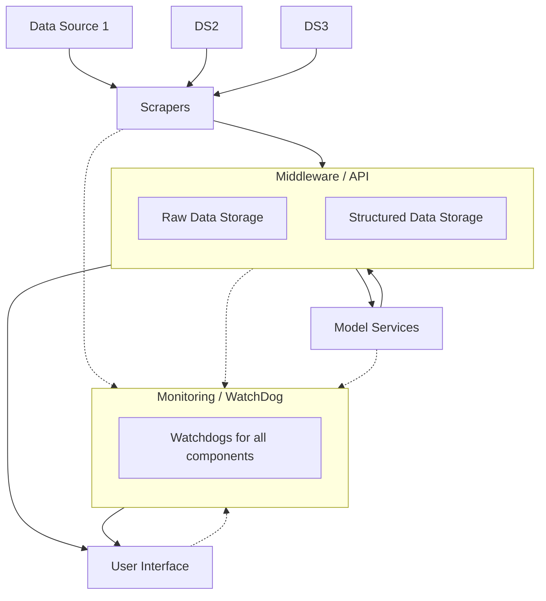

# SensEarth

A digital twin of sensor data sources.

## Characteristics

SensEarth is designed to ingest, validate, enrich, model and serve sensor data from public and private sources. The key characteristics below describe the system goals and practical ideas for implementation.

- **Capture:** reliably collect data from heterogeneous open data sources (HTML pages, JSON APIs, CSVs, JS-rendered pages, streaming endpoints).
- **Data quality & validation:** apply automated quality checks (schema validation, completeness, ranges, duplicate detection, timestamp consistency) and track provenance for every raw payload.
- **Observability & monitoring:** monitor ingestion success/failure rates, lag, data volume, model performance, and alert on regressions.
- **Presentation:** provide dashboard summaries, time-series charts, and detailed records for individual sensors and sources.
- **Modularity & extensibility:** make source adapters, parsers, feature generators and models pluggable so adding a new source or model is low-effort.

## Architecture

### Scapers

Requirements:
* multiple scrapers can be implemented (they should be able to ingest various sources, like groundwarter levels, traffic data, web logs, weather)
* first, let's focus on scraping numerical data
* they should be robust; should not fail
* it should be easy to add an additional scraper
* scrapers can write directly to the database in the beginning (it is the easiest to implement)
* use something like scrapy in order to maintain robustness

### Storage System & Middleware

We use 2 storage systems for the scraped data: (1) raw data storage and (2) structured data storage.

**Raw Data Storage**:
* this is basically a document storage of all the parsed sources
* the raw scraped documents are stored here and can be later used to rebuild the database with historic data
* for implementation use MinIO; you can also use raw storage capabilities of postgres

**Structured Data Storage**:
* structured data storage will store all the data from the parsed sensors
* it will use the following tables:
    * sensor node (can host more sensors)
    * sensor (can belong to a node, or can be independent)
    * sensor type (defines phenomena, units, max/min values etc.)
    * sensor measurement
* for implementation use Postgres + TimescaleDB + PostGIS (optional)

**Middleware**:
* midleware routes data to modeling services as the data arrives
* middleware offers endpoints for retrieving the data for the user interface
* middleware enables registering of new sensors and linking them to scrapers

### Modelling

* we can have multiple models; such as time series prediction or anomaly detection or specialized services
* models are standalone and plug-and play

### Monitoring (WatchDog)

Requirements for monitoring:
* monitors if components of the system are running
* monitors success/failure of the scrapers
* monitors success/failure of the modeling services
* monitors timing of the models
* monitors uptime of the components

### User Interface

* use a framework, like Next.js
* framework should display data from all the above components; monitoring, status of scrapers, data, models
* it should have a dashboard + possiblity to build custom dashboards
* it should have a detailed view of the data
* it should show error metrics of the models through time

## Simple architecture

## Roadmap

- [ ] Create robust scraping
- [ ] Create robust middleware
- [ ] Create robust modeling for anomaly detection