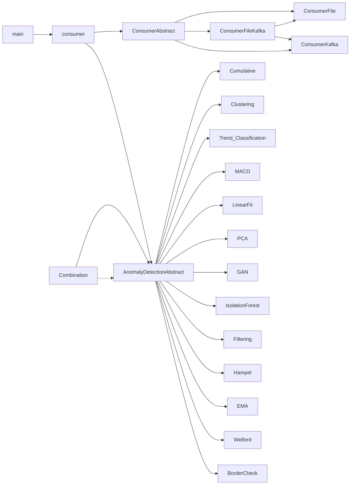

# Anomaly detection for streaming data

Anomaly detection service is used to detect anomalies in streaming data (time series). It implements several methods from several ML frameworks.

## Usage
`python main.py [-h] [-c CONFIG] [--f]`

| Short   |      Long     |  Description |
|----------|-------------|------|
| `-h` | `--help` | show help |
| `-c CONFIG` | `--config CONFIG` | name of the config file located in configuration folder (example: `config.json`) |
| `-f` | `--file` | If this flag is used the program will read data from file specified in config file instead of kafka stream|
| `-fk` | `--filekafka` | If this flag is used the program will read data from file specified in config file and then from kafka stream|
| `-w` | `--watchdog` | If this flag is used the program will send a ping to watchdog every 30 seconds|

In order to interact with kafka separately from the anomaly detection module e.g. to check messages in a specific topic, scripts from the kafka installation can be run with appropriate flags. For example to view messages in topic 'test' (on windows):
`.\bin\windows\kafka-console-consumer.bat --bootstrap-server localhost:9092 --topic test --from-beginning`


## Development Environment
Create virtual environment for development:
`conda create --name anomaly python=3.8`

Go to proper directory and intall requirements with:
`pip install -r requirements.txt`


## Architecture
The anomaly detection program consists of three main types of components:
1. Consumer component
2. Anomaly detection component
3. Output component
Each component has many implementations that are interchangeable. Which ones are used depends on the task the program is solving.
Normalization is an additional optional component which replaces anomalic samples with normalized ones.
Another optional component is Visualization component which doesn't affect the general workflow and is used for streaming data visualization.



### Configuration file
The program is configured through configuration file specified with -c flag (located in configuration folder). It is a JSON file with the following structure:
```json
{
    // ...
    // consumer configuration
    // ...
    "anomaly_detection_alg": ["alg1", "alg2", "algN"],
    "anomaly_detection_conf": [{
        // ...
        // anomaly detection configuration
        // ...
        "input_vector_size": ...,
        "averages": [...],
        "shifts": [...],
        "time_features": [...],
        "normalization": "normalization component", // optional
        "normalization_conf": "normalization component configuration", // optional
        "output": ["list of output components"],
        "output_conf": ["list of output components configurations"],
        "visualization": "visualization component", // optional
        "visualization_conf": "visualization component configuration" // optional
      }]
}
```
The specific configurations for components will be presented in following chapters
For more details see example configuration files in configuration folder.

### Consumer
Consumer components differ in where the data is read from.
1. **Kafka consumer:** Data is read from one or more kafka topics. Each topic cooresponds to a seperate anomaly detection algorithm from field "anomaly_detection_alg" which has the configuration defined in a cooresponding object in the list under "anomaly_detection_conf" field. <br>
**Input format:** The format of the message read from kafka topic must be of shape:
   ```json
   {
   "ftr_vector":  array (a feature vector) of values,
   "timestamp": timestamp of the data in datastream in unix timestamp format
   }
   ```
   The conciguration file must specify following parameters:
      * bootstrap_servers: Kafka server. (example: ["localhost:9092"]),
      * auto_offset_reset: Where the consumer starts to read messages. If "latest", when comsumer is started, it will continue reading from the message where it last left off. If "earliest" it will read from the oldest available message onwards. (example: "latest"),
      * enable_auto_commit": If True , the consumer’s offset (the point in the topic where messages are read) will be periodically committed in the background. Otherwise offsets can be commited manually. (example: "True"),
      * group_id: The name of the consumer group. (example "my-group"),
      * value_deserializer":  Any callable that takes a raw message value and returns a deserialized value. (example "lambda x: loads(x.decode('utf-8'))"),
      * topics: A list of topics streaming the data. (example ["anomaly_detection"]),

   Kafka consumer also has the option to filter data stored in the specified topic. To read only the messages with timestamps in a specific range, we can specify the field "filtering", with the target time and tolerance. Only the messages with time of day +- tolerance will be inserted into the algorithm. The configuration file must specify:
      * filtering: An array of filtering parameters for each topic - either "None" or array of shape "[[target_time_hour, ...minute, second], [tolerance_hour, ...minute, ...second]]" . (example: ["[[1, 0, 0], [0, 0, 30]]"] - will read only data with time of day 00:59:30 - 01:00:30).

2. **File consumer:** Data is read from a csv or JSON file. <br>
**Input format:**
   * CSV: The csv can have a "timestamp" (strings in unix timestamp format) column. All other columns are considered values for detecting anomalies.
   * JSON: The JSON file must be of shape:
      ```json
      {
      "ftr_vector":  array (a feature vector) of values,
      "timestamp": timestamp of the data in datastream as strings in unix timestamp format
      }
      ```
   File consumer also requires a list of anomaly detection algorithms, multiple algorithms can be used on the same input data set (similar thing aplies for configuration). The configuration file must specify the following parameters:
   * file_name: The name (and location) of the file with the data. (example: "sin.csv").
   * anomaly_detection_alg: List of algorithms to be used on the time series. (example: ["Welford()", "Welford()", "MACD()"]) Each of the listed algorithms requires its own configuration to be added.

3. **File kafka consumer:** Used when first part of the datastream is written in a file and then continues as kafka stream. Also it can be used for model-less aproaches as a way of "learnig" from train data, so that the anomaly detection would work better on the actual kafka input stream. <br>
**Input format:**
   * CSV: The csv can have a "timestamp" (strings in unix timestamp format) column. All other columns are considered values for detecting anomalies.
   * JSON: The JSON file must be of shape:
      ```json
      {
      "ftr_vector":  array (a feature vector) of values,
      "timestamp": timestamp of the data in datastream as strings in unix timestamp format
      }
      ```
   File kafka consumer also requires a list of anomaly detection algorithms, however only the first algorithm from a list is used for anomaly detection (similar thing aplies for configuration). The configuration file must specify the following parameters:
      * file_name: The name of the file with the data, located in data/consumer/ directory. (example: "sin.csv"),\
   The following parameters are similar to ones in Kafka consumer:
      * bootstrap_servers: Kafka server. (example: ["localhost:9092"]),
      * auto_offset_reset: (example: "latest"),
      * enable_auto_commit": (example: "True"),
      * group_id: (example "my-group"),
      * value_deserializer": (example "lambda x: loads(x.decode('utf-8'))"),
      * topics: A list of topics streaming the data. (example ["anomaly_detection"]),

### Output
Output component differs in where the data is outputted to. more than one output conmonent can be specified. It recieves three arguments from the anomaly detection component: value (the last value of the stream), timestamp and status (wether data is anomalous). The following arguments of configuration file are general for all outputs:
* send_ok: A boolean telling the component if OK samples are to be sent to output. This is an optional parameter. If it is not specified True is taken.

1. **Terminal output:** Timestamp, value and status are outputed to the terminal. It does not require any parameters in the configuration file.

2. **Kafka output:** Value is outputed to separate kafka topic. <br>
**Output format:** The outputted object is of form:
```json
{
 "algorithm": anomaly detection algorithm used,
 "value": the sample from the datastream,
 "status": result of the anomaly detection algorithm,
 "timestamp": timestamp of the data in datastream in unix timestamp format,
 "status_code": result of the anomaly detection algorithm (descriptive),
 "suggested_value": optional field, that can suggest a "normal" value if anomaly is detected
}
```
Status codes are defined in a following way: OK: 1, warning: 0, error: -1, undefined: 2. It requires the following argments in the config file:
   * node_id: The anomalies will be sent to topic: anomalies_[node_id] (example: 1).

3. **File output:** Data is outputed to a JSON csv or txt file. <br>
**Output format:**
   * csv: The csv file contains the following fields:
      * "algorithm": anomaly detection algorithm used,
      * "value": the sample from the datastream,
      * "status": result of the anomaly detection algorithm,
      * "timestamp": timestamp of the data in datastream in unix timestamp format,
      * "status_code": result of the anomaly detection algorithm (descriptive),
      * "suggested_value": optional field, that can suggest a "normal" value if anomaly is detected
   * JOSN: The JSON file contains a single field "data" whose value is an array of objects of shape:
   ```json
   {
   "algorithm": anomaly detection algorithm used,
   "value": the sample from the datastream,
   "status": result of the anomaly detection algorithm,
   "timestamp": timestamp of the data in datastream in unix timestamp format,
   "status_code": result of the anomaly detection algorithm (descriptive),
   "suggested_value": optional field, that can suggest a "normal" value if anomaly is detected
   }
   ```
   The output in the txt file is the same as terminal output. Status codes are defined in a following way: OK: 1, warning: 0, error: -1, undefined: 2. It requires the following arguments in the config file:
   * file_name: The name of the file for output located in the log/ directory. (example: "output.csv"),
   * mode: Wether we want to overwrite the file or just append data to it. (example: "a").
3. **Influx output:** Data is outputed to the influx database <br>
The following structure is used in output_conf:
    ```json
    {
     "ip": "localhost",
     "port": "8086",
     "org": "naiades",
     "token": "...",
     "bucket": "...",
     "measurement": "...",
     "tags": "{}",
     "unix_time_format": "s"/"ms"/"ns"/"us",
     "has_suggested_value": true/false
     }
     ```
     All the values described in 3) ("algorithm", "value", "status",...) are sent to the database.

### Visualization
An optional conponent intendet to visualize the inputted stream.
1. **Graph visualization:** The data is represented as points on graph. All anomaly detection component plot the ftr_vector values and some plot additional values like running average, standard deviation... It requires the following arguments in the config file:
   * num_of_points: Maximum number of points of the same line that are visible on the graph at the same time. (example: 50),
   * num_of_lines: Number of lines plotted on the graph. (TODO: it depends on the anomaly detection algorithm so in future this component will be removed) (example: 4),
   * linestyles: A list, specifying the styles of the lines plotted. (example: ["wo", "r-", "b--", "b--"]).

2. **Histogram visualization:** It visualizes the quantity of values, from ftr_vector stream. It requires the following arguments in the config file:
   * num_of_bins: Number of bins in the histogram's range. (example: 50),
   * range: The interval shown on the histogram. (example: [0, 10]).

3. **Status Points Visualization:** Used to visualize processed data e.g. outputs of EMA or Filtering. The points are colored white if OK, warning yellow, error red or undefined blue. It requires the following arguments in the config file:
   * num_of_points: Maximum number of points of the same line that are visible on the graph at the same time. (example: 50),
   * num_of_lines: Number of lines plotted on the graph. (TODO: it depends on the anomaly detection algorithm so in future this component will be removed) (example: 4),
   * linestyles: A list, specifying the styles of the lines plotted. (example: ["wo", "r-", "b--", "b--"]).

### Normalization
An optional component that replaces anomalic values with normalized ones, which prevents values that follow anomalic values to be considered anomalic (because of shifted values). It is also usefull for "cleaning" the stream of anomalic values since this value is also returned to the output. For now only Isolation forest anomaly detection component has this implemented.
1. **Last N average:** The normalized value is the average of the last N samples. It requires the following arguments in the config file:
   * N: An integer representing the number of last samples to be taken into consideration (example: 5).

2. **Periodic last N average:** The normalized value is the average of N samples that are a certain period apart. This is usefull for timeseries that are periodical. It requires the following arguments in the config file:
   * N: An integer representing the number of last samples to be taken into consideration (example: 5),
   * period: An integer representing the period between samples (example: 24).

### Anomaly detection
The component that does the actual anomaly detection. It recieves data from a consumer component and sends output to output components. The following arguments are general for all components:
* input_vector_size: An integer representing the dimensionality of the inputted vector (number of features) (example: 2),
* use_cols: A list of integers representing the indexes of elements in the inputted vector to be used. (example: [0, 2]),
* output: A list of output objects (example: "FileOutput()"),
* output_conf: A list of output objects configurations,
* normalization: A normalization object. This is an optional component (example: "LastNAverage()"),
* normalization_conf: The normalization's configuration,
* visualization: A visualization object. This is an optional component (example: "GraphVisualization()"),
* visualization_conf: The visualization's configuration
* **FEATURE CONSTRUCTION ARGUMENTS:**
* averages: Specifies additional features to be constructed. In this case averages of the last i values of a feature are calculated and included in the feature vector. (example: [[2, 3, 5], [2]] -> this means that the first feature gets addtitonal features: average over last 2 values, average over last 3 values and average over last 5 values and the second feature gets average over last 2 values),
* periodic_averages: A list (for different features) of lists (for different periods) of lists of length 2 where the first element is the period and the seconf is a list of N-s (number of samples of this periodic sequence from which we will calculate average). (example: [[[5, [2, 3]], [2, [4, 5]]] -> in this example we have one feature with two periods ( 5 and 2). The first one contains 2 and 3 elements of the sequence and the second one 4 and 5),
* shifts: Specifies additional features to be constructed. In this case shifted values of a feature are included in the feature vector. (example: [[1, 2, 3], [4, 5]] -> this means that the first feature gets addtitonal features: value shifted for 1, value shifted for 2 and value shifted for 3 and the second feature gets value shifted for 4 and value shifted for 5),
* time_features: Specifies additional features to be constructed. In this case the following features can be constructed: day of month, month of year, weekday, hour of day. Note that construction of these features requires unix timestamp format of timestamp. If that is not hte case pass an empty array as parameter for that field. (example: ["day", "month", "weekday", "hour"]).
* time_average_shifts: A list with 2 elements, specifying the time (in seconds) and the number of time averages to construct. (example: [3, 3600] -> 3 shifts are created with 3600 second averages)
* max_memory: this parameter is needed when using the time__average_shifts. Specifies how many latest samples of the time series are stored in memory. (example: 500)
1. **Border check:** A simple component that checks if the ftr_vector falls within the specified interval and also gives warnings if it is close to the border. It requires the following arguments in the config file:
   * warning_stages: A list of floats from interval [0, 1] which represent different stages of warnings (values above 1 are over the border). (example: [0.7, 0.9]),
   * UL: Upper limit of the specified interval. (example: 4),
   * LL: Lower limit of the specified interval. (example: 2).

2. **EMA:** Calculates the exponential moving average of test values. It recieves data from a consumer component and sends output to output components.
EMA is calculated using past EMA values and the newest test value, giving more weigth to newer data. It is calculated in the following way:
EMA_latest = ftr_vector x smoothing + EMA_last x (1 - smoothing). Warnings are issued if the EMA approaches UL or LL.\
It requires the following arguments in the config file:
   * N: Parameter from which the smoothing is calculated - roughly translates to how many latest test values contribute to the EMA (example: 5),
   * warning_stages: similar to border check - levels to identify EMA approaching limits (example: [0.7, 0.9]).

3. **Isolation Forest:** iForest algorythm. The basic principle is that an anomalous datapoint is easier to separate from others, than a normal datapoint. In the current implementation, one instance consists of N consecutive (or non-consecutive) test values. Instances are constructed via the "shifts" module. The algorythm can also be modified by adding other features. A pre-trained model can be loaded from the "models" folder, or a new model can be trained with the appropriate train data. Arguments in config file when we're training a new model:
   * train_data: Location of the train data. (example: "data/Continental/0.txt") Data should be in csv format, as it is described in [Training files](#training-files). This is an optional parameter. If it is not specified load_model_from is expected,
   * max_features: The number of features to draw from X to train each base estimator. (example: 4),
   * max_samples: The number of samples to draw from X to train each base estimator. (example:100),
   * contamination: The proportion of outliers in the dataset. (example: 0.1 if we know we have 10% of outliers in our dataset) Can be set to "auto",
   * model_name: Name of the model, which will be saved in "models/" folder,
   * retrain_interval: An integer representing the number of samples recieved by the anomaly detection component that trigger model retraining. If this optional parameter is not present the model is not retrained. Every time the model is retrained the training set is saved to IsolationForest_last_{samples_for_retrain}_samples.csv file in data folder and configuration file is changed so that the next time the model is ran it will train on this dataset (eg. in case of crash and rerun). (example: 100),
   * samples_for_retrain": An integer representing the number of most recent samples that are used to retrain the model. If it is not specified it uses all samples (may cause memory overflow). If training dataset is specified those samples are also considered for retraining untill they are overwritten by newer samples. (example: 2000),
   * retrain_file: Path and file name of the file in which retrain data will be stored (example: "./data/retrain/test.csv").
Example model train config: IsolationForestTrain.json
Model train mode is activated if "load_model_from" is not in the config file, and "train_data" is defined. After training, the trained model will be used to continue with evaluation of data from consumer automatically.
If we have a pre-trained model, we load it by specifying:
   * load_model_from: location of pre-trained iForest model. This is an optional parameter. If it is not provided train_data must be and vice versa. If neither of them are provided the retrain interval must be and the model will output undefiner results untill the first retrain.  (example: "models/IsolationForest").

4. **PCA + Isolation forest:** PCA (Principal component analysis) projects high dimensional data to a lower dimensional space. Very effective first step, if we have a large number of features in an instance (even > 1000). First, PCA is applied to the input data followed by the Isolation forest algorithm. In addition to the Isolation forest requirements, the following parameters must be specified in the config file: \
    * N_components: dimensionality of the PCA output space (example: 5).

5. **Welfords algorithm:** Very simmilar to border check only in this case UL and LL are calculated with every new sample (with equations: UL=online_mean_consumption+X*online_standard_+deviation and LL=online_mean_consumption-X*online_standard_+deviation). There are two modes for this method. Frist one calculates mean and standard deviation of the previous N samples and the second one calculates them for all the datasamples so far.
It requires the following arguments in the config file:
   * N: An integer representing the number of samples used for calculating mean and standard deviation. If it is not specified all samples till some point will be used in calculation. (example: 5),
   * warning_stages: A list of floats from interval [0, 1] which represent different stages of warnings (values above 1 are over the border). (example: [0.7, 0.9]),
   * X: A parameter in the equation for calculating LL and UL. The larger it is the bigger the interval of normal values it (more false negatives) (example: 1.5).

6. **Filtering:** Digital filtering is applied to the input data via a lowpass filter, smoothing the signal. The filter used is Butterworth of the order specified in config. This helps to identify trend changes in the data. Similarly to Border check and EMA, warnings are issued if the filtered signal approaches UL or LL.

The filtered signal helps to identify trend shifts. (mode 0)
Taking the difference between the actual value of each new data point from the current filtered signal value can help to identify sudden spikes. (mode 1) In mode 1 a normalised value is calculated: value = last change in value/(UL-LL). The normalised value is classified according to warning stages or marked as an error id the value is >1 or <-1.

It requires the following arguments in the config file:
   * UL: Upper limit of the specified interval. (example: 4),
   * LL: Lower limit of the specified interval. (example: 2),
   * warning_stages: similar to e.g. EMA (example: [0.7, 0.9]),
   * filter_order: order of the filter - how many latest points are used in the filter response. Most of the time, somewhere around order 3 is enough, as a higher order filter will cause a delay in the filtered signal compared to the real-time data. (example: 3),
   * cutoff_frequency: the frequency, at which the filter response starts to drop off. Lower frequency components of the input data will be passed through, but higher frequency components are filtered out. This is not an actual physical frequency but rather a float between 0 and 1. (example: 0.1),
   * mode: either 0 or 1; 0 - output is the filtered signal, 1 - output is the difference between the test value and the filtered signal (this is for visualization purposes).

7. **Hampel:** The Hampel filter is used to both detect outliers and replace them with "normal" values. The filter analyses a window of data including data points before and after the data point in question. The median value of these points is calculated, as well as the standard deviation. If the point in question is more than n_sigmas times the standard deviation away from the median it is marked as an outlier and replaced with the median value. Keep in mind that this algorithm can only analize each data point, when there are W points available after that point. The algorithm thus works with a delay of W points.
It requires the following arguments in the config file:\
    * n_sigmas: Tolerance of the algorithm (example: 3),
    * W: Window size - in the calculations W points before and W after the point in question are used (example: 5),
    * K: A multiplier which is dependent on the distribution of input data. For gaussian it is 1.4826.

8. **GAN:** This model is built on the autoencoder principle. N dimensional data is given to the model which has a bottleneck of signifficantly fewer dimensions. The model is trained on "good" data, where it learns to reproduce the inputs very precisely. When the trained model is given an anomalous feature vector it cannot reproduce it exactly. The measure of how anomalous the datapoint is, is the reconstruction error, which is a mean squared error comparing the input and output feature vectors. Based on the reconstruction errors on the training set, a threshold is determined. When the model detects a high reconstruction error, the datapoint is labeled as an outlier.
It requires the following arguments in the config file:\
   * N_shifts: Number of past data, which are used to construct the feature vector. (example: 9),
   * N_latent: Dimensionality of the latent space (example: 3),
   * K: Koefficient to determine the threshold for reconstruction error from max_err - largest error on the training set -> threshold = K*max_err (example: 0.95).
   * retrain_interval: An integer representing the number of samples recieved by the anomaly detection component that trigger model retraining. If this optional parameter is not present the model is not retrained. Every time the model is retrained the training set is saved to IsolationForest_last_{samples_for_retrain}_samples.csv file in data folder and configuration file is changed so that the next time the model is ran it will train on this dataset (eg. in case of crash and rerun). (example: 100),
   * samples_for_retrain": An integer representing the number of most recent samples that are used to retrain the model. If it is not specified it uses all samples (may cause memory overflow). If training dataset is specified those samples are also considered for retraining untill they are overwritten by newer samples. (example: 2000),
   * retrain_file: Path and file name of the file in which retrain data will be stored (example: "./data/retrain/test.csv").<br>
To see the train and retrain file formats see [Training files](#training-files).

9. **Clustering:** This model usses dbscan clustering method (from sklearn) to extract and save core samples. Every incomming sample is then compared to those core samples. If the euclidian distance of the sample to every core sample is greater than treshold then the sample is anomalous.
It requires the following arguments in the config file:\
* eps: A float representing the maximum distance between two samples for one to be considered as in the neighborhood of the other,
* min_samples: An integer representing the number of samples (or total weight) in a neighborhood for a point to be considered as a core point. This includes the point itself,
* treshold: A float, representing the euclidean distance that is required to determine anomalies (the larger the distance the less points are anomalous),
* retrain_interval: An integer representing the number of samples recieved by the anomaly detection component that trigger model retraining. If this optional parameter is not present the model is not retrained. Every time the model is retrained the training set is saved to IsolationForest_last_{samples_for_retrain}_samples.csv file in data folder and configuration file is changed so that the next time the model is ran it will train on this dataset (eg. in case of crash and rerun). (example: 100),
* samples_for_retrain": An integer representing the number of most recent samples that are used to retrain the model. If it is not specified it uses all samples (may cause memory overflow). If training dataset is specified those samples are also considered for retraining untill they are overwritten by newer samples. (example: 2000),
* retrain_file: Path and file name of the file in which retrain data will be stored (example: "./data/retrain/test.csv").

10. **MACD:** TODO

11. **Linear fit:** TODO

12. **fb_Prophet()** An anomaly detection algorithm based on the Prophet forecasting tool. Prophet produces an uncertainty interval along with its forecast. The uncertainty interval is used as a tolerance band. When an incoming data point falls out of the tolerance band, it is labelled as an anomaly. The forecast with the tolerance band is produced periodically, also using the new incoming data. The following fields are required in the configuration:
    *  uncertainty_interval: Prophet uncertainty parameter - a float value between 0 (lowest tolerance) and 1(highest tolerance). (example: 0.85),
    *  forecast_horizon: A list of two values. First is the number of periods to forecast, second is the period length: 's' - second, 'min' - minute, 'h' - hour, 'd' - day, 'm' - month, 'y' - year. (example: [24, 'h'] - a prediction for 24 hours in advance is made; [1440, 'min'] - also 24 hours in advance, but with finer granularity),
    *  retrain_interval: The number of incoming data messages, before a retraining of the forecast is done. It is important this interval is shorter than the forecast horizon (example: 50),
    *  min_samples: the minimum required number of samples used to make a forecast - if there aren't enough samples the algorithm will return 'Undefined'. (example: 1000),
    *  max_samples: the maximum number of samples which are stored in memory. (example: 5000),
    *  history_file: optional - an initial set of samples to make the first predictions immediately when the component is started. The csv file should contain columns: 'ds' - timestamps in datetime format, 'y' - values (example: "data/retrain/retrain_file.csv")

13. **Combination:** Not really a stand-alone algorithm but rather a combination of arbitary algorithms with the idea to obtain a single estimate about anomalousness of the sample. From each algorithm's estimate a final status is determined using a specific logic (that can be completely case-specific).
It requires the following arguments in the config file:\
   * anomaly_algorithms: A list of anomaly detection algorithms used.
   * anomaly_algorithms_configurations: A list of anomaly detection algorithm's configurations. These configurations have the same fields as stand-alone anomaly detection algorithms would have. The outputs
   * status_determiner: An object containing a logic to determine the final status. Additional objects for that purpose can be implemented.
   * status_determiner_conf: Configuration for the status determiner function.

The following status determiner methods are currently available:
   * AND(): Gives error if all statuses are error, warning if all statuses are warrning (or error), otherwise OK. Undefined statuses are ignored (status_determiner_conf can be empty).
   * OR(): Gives error if at least one status is error, warning if at least one status is warrning, otherwise OK. Undefined statuses are ignored (status_determiner_conf can be empty).
   * PercentScore(): This determiner is used to produce the anomaly meta signal. It requires the following fields in status_determiner_conf:\
        *interval: The time window of past statuses to observe in seconds (example: 3600)\
        *data_interval: The (approximate) interval of incoming data in seconds (example: 60)\
    The output of this determiner is calculated as the normalized sum of all the anomaly scores in the defined window of past data. If one of the algorithms reports       an anomaly, its impact will be greater than if only a warning is issued.
   * PercentScore_Alicante(): The same as PercentScore(), except anomalies which happen as a result of a large drop in the datastream are ignored (filtered by the AD alorithm's string status message)


#### Training files:
Training files for the algorithms that need training (GAN, isolationForest and PCA) must be provided in csv format with two specified columns: timestamp and ftr_vector. The first field contains a timestamp (in unix timestamp format) of the sample and the second one contains a string, representing the feature vector (of the same format as the une that would be recieved from consumer). <br>
Same holds for retrain files (generated automatically by the algorithm).

## Examples:
For configuration examples see configuration folder. <br> <br>
For example with Braila data run `python main.py -f -c braila/"configuration_file_name"`. The results will appear in log directory and can be analized with braila_data.ipynb notebook in notebooks directory.
